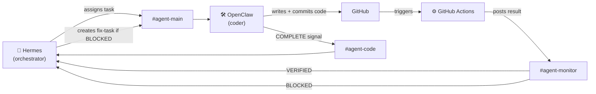

<div align="center">

# 🔮 Nexora AI

### A self-healing dual-agent system — built for NMG Labs Forge Sprint 02 (Hermes × OpenClaw Edition)

*Nexora — **Nex**us (connection) + Aur**ora** (new beginning)*
*Two AI agents that talk only through Slack, catch their own mistakes, and fix them — without a human ever touching the code.*


</div>

---

## 📋 Table of Contents

- [The Idea](#-the-idea)
- [Architecture](#-architecture)
- [Live Proof This Works](#-live-proof-this-works)
- [How It Satisfies the Qualifier](#-how-it-satisfies-the-qualifier)
- [Project Structure](#️-project-structure)
- [Quick Start](#-quick-start)
- [Demo Script](#-demo-script-for-sprint-day)
- [Roadmap](#-roadmap)

---

## 🧠 The Idea

Most agent demos show one agent doing one task, once. **Nexora AI goes further — it's a closed loop.**

| Agent | Role |
|---|---|
| 🧭 **Hermes** | The orchestrator — decides what needs to be done, assigns it, and watches the results |
| 🛠️ **OpenClaw** | The coder — picks up tasks, writes code, commits, and reports back |
| ⚙️ **GitHub Actions** | The judge — runs the test suite on every commit |
| 🔁 **The Loop** | When CI fails, Hermes doesn't wait for a human. It reads the failure, creates a new fix-task, and hands it back to OpenClaw — until the code is green again |

> No agent-to-agent API calls. No manual edits once a run starts. Every step is visible, timestamped, and logged in Slack.

## 🗺️ Architecture



## ✅ Live Proof This Works

This isn't a mockup — the loop has already run for real. Check the commit history:

| Commit | What Happened | CI Result |
|---|---|---|
| `fef66ff` | Initial CI + Slack integration goes live | 🟢 **VERIFIED** |
| `e032e4e` | A test is deliberately broken | 🔴 **BLOCKED** — Slack alert fired automatically |
| `8545af8` | The fix is pushed | 🟢 **VERIFIED** — system self-heals |

Every one of these was logged live in Slack, in `#agent-monitor`, with **zero manual notification**.

## 🧩 How It Satisfies the Qualifier

| Requirement | Status |
|---|---|
| Hermes + OpenClaw installed & Slack-connected | ✅ |
| 3 channels: `#agent-main`, `#agent-code`, `#agent-monitor` | ✅ |
| Mini challenge — fetch titles from 3 URLs, logged in Slack | ✅ `scripts/fetch_titles.py` |
| Zero manual code edits during a run | ✅ enforced in `AGENTS.md` |
| Communication pattern: assign → received → complete → verified/blocked | ✅ |
| **Bonus:** CI/CD self-correction (goes beyond the mini-challenge) | ✅ proven above |

## 🗂️ Project Structure

```
nexora-ai/
├── AGENTS.md                    # rules both agents follow
├── NAME.md                      # project identity
├── requirements.txt
├── config/
│   ├── hermes_config.json       # not committed — see .gitignore
│   └── openclaw_config.json     # not committed — see .gitignore
├── scripts/
│   ├── fetch_titles.py          # the qualifier mini-challenge
│   ├── slack_client.py          # shared Slack wrapper
│   └── hermes_loop.py           # the self-healing orchestration engine
├── tests/
│   └── test_fetch_titles.py
└── .github/workflows/
    └── ci.yml                   # runs tests + notifies Slack on every push
```

## 🚀 Quick Start

```bash
git clone https://github.com/eshachaturvedi7-coder/nexora-ai.git
cd nexora-ai

python -m venv venv
venv\Scripts\Activate.ps1      # Windows
# source venv/bin/activate     # macOS/Linux

pip install -r requirements.txt
python scripts/fetch_titles.py  # run the mini-challenge
```

CI runs automatically on every push to `main`, and posts results straight to `#agent-monitor`.

## 🎬 Demo Script (for Sprint Day)

1. Show the 3 live Slack channels — Hermes assigns, OpenClaw executes.
2. Show `scripts/fetch_titles.py` running the mini-challenge live.
3. Break a test on purpose, push it.
4. Show the red ❌ in GitHub Actions and the **BLOCKED** alert in `#agent-monitor` — automatic, no human trigger.
5. Push the fix. Show the green ✅ return and the **VERIFIED** message.
6. Close on:
   > "No one touched the code after the first push. The system caught its own mistake and fixed it."

## 🔭 Roadmap

- [ ] Replace manual OpenClaw role-play with a real LLM-backed listener agent
- [ ] Add richer failure classification (flaky test vs. real bug) before auto-retry
- [ ] Dashboard view of task history outside Slack

---

<div align="center">

Built with 🔮 by **Esha Chaturvedi** for NMG Labs Forge Sprint 02

</div>